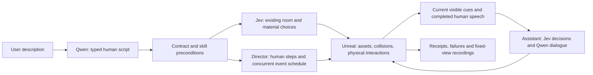

# Natural-language scene and human scenario director

This prototype turns a Chinese or English description into a bounded scene
recipe and executable human performance. The human needs assistance; the
companion observes and responds independently. It is an authoring system, not
a trained assistant or an unrestricted text-to-3D generator.

The director knows the script. The evaluated assistant must not. Native entity
state, routes, future events, seeds and authoring instructions are not assistant
observations. Only current visible cues and completed in-world human speech cross
that boundary. Inputs remain engine metadata and synthetic speech, not RGB/VLM or ASR.

## Use

Open `/director` on the live assistance service. Describe the room and actions,
prepare the proposal, choose first or third person, and start. Watch and take over
through **VISTA Six Rooms Live AI** in Moonlight. The browser controls the game;
it does not render Unreal itself. Stop prevents subsequent steps/events and
returns manual control and normal interaction hints. Replay reuses the compiled
script and cached actor speech; Assistant inference remains live.

Actual model-generated examples:

1. Warm, dark-wood study: walk to a phone, pick it up, answer, say “I will call you
   after the meeting,” hang up and walk to the window.
2. Existing home: start in the bedroom, pick up a call, say “I am on my way,” walk
   to the bathroom, look at the tub, wait, hang up and request help turning off
   the tap. Concurrent stove-on and running-water events start at 0 and 5 seconds.
3. Walk from entry through living room, kitchen, bedroom, office and bathroom,
   then return to entry; no dialogue or hazards.

## Scope

- Existing six-room home, or one lounge/study/bedroom assembled from prior assets.
  Three floor looks, two lighting settings and three arrangements retain the
  existing 54 combinations. Walnut is tinted oak. No new mesh generation.
- At most 16 steps: walk, look, pick up/answer/hang up a phone, speak or wait.
  Six short English male speech lines maximum; a remote telephone speaker can
  use a separate voice. The model cannot script the Assistant's answer or success.
- Home events: stove, bath water and misplaced keys, each once, onset 0–180 s.
  Micro rooms do not inherit functional stove/bath bindings.
- Navigation uses trusted graph anchors and existing collision-aware corner
  steering. Models never generate coordinates, code, console commands or poses.
- Native state/reach/contact guards and terminal action receipts are retained.
  Blocked walking or manipulation stops the performance with an explicit error.
- Actor ownership expires after eight wall-clock seconds without heartbeat;
  scene reset invalidates old commands. Perspective stays fixed during a take.

No new cooking/driving/sitting/typing animation, phone placement, arbitrary
buildings, independent multiple humans, public hosting or isolated multi-user
worlds are added. Visual quality and physical motion inherit the prior prototype.
Each successful replay is an observed execution, not a guarantee of identical
physics, model replies or outcomes on later runs.

## Evidence

Host receipts are in `workspace/runs/scenario-director-20260921-a/` (R).

- 108 source tests, including 15 new contract/runner tests. Native build 6 succeeds.
- Final-build `micro-i-first` and `micro-i-third` complete all six phone steps,
  with actual grip, phone pose and native audio. Fixed view and sampled movement
  continuity pass. Earlier `micro-d` takes preceded the eye-level phone gaze fix.
- `home-g-first` and `home-g-third` complete the ten-step home performance and
  start both scheduled native events. The Assistant detects water risk, attempts
  help and reports a blocked approach. **Actor completion is not intervention
  success.** The stove lies outside the observed route in these examples; starting
  an event is not proof of its recognition. These takes use build 5; build 6 adds
  wall-clock ownership expiry and restoration of manual HUD hints.
- `tour-h-third` completes the six-room sequence and stairs on build 5. This
  covers that authored order, not every position or possible room permutation.
- `controls-acceptance.json`: stop, concurrent mutation rejection, ownership
  expiry and scene reset. `controls-final-build.json` confirms actual web-button
  play/stop, wall-clock lease expiry, HUD restoration and rejection of a web
  mutation without its session token. Unsupported lunar-base/spacecraft input
  returns an explanation without changing the scene (`ui-unsupported.json`).
- Three initial successful preparations, including actor voice cache filling:

| Example | Qwen script | Jev selection | Until proposal + actor speech ready |
|---|---:|---:|---:|
| Study phone | 2652 ms | 445 ms | 6.80 s |
| Concurrent home | 6506 ms | 548 ms | 12.62 s |
| Silent room tour | 3845 ms | 424 ms | 4.30 s |

These are functional examples after prompt fixes, not a latency benchmark or
success rate. They exclude engine startup, cold assets/shaders and client streaming.

Initial model outputs used invalid room/target names or falsely rejected a valid
combination. Validators prevented scene mutation; new requests after prompt fixes
remain distinguishable from the retained failures. Startup readiness, nullable
home/micro selection and an action-generation race were fixed without bypassing
contact/collision checks. No paid request was automatically retried.

Captured assistant requests are separately audited for forbidden director fields.
This engineering boundary check is not sealed evaluation isolation. Human speech
is authored text played natively, then supplied through the existing completed-
speech bridge. Cached warnings are selected at runtime; they are not post-dubbing.
The controller never injects a scripted assistant answer or forces success.

## Research role

The platform can support controllable scenario generation and interventions:

1. Score whether requested objects, actions and concurrent events actually occur.
2. Vary timing, visibility and competing needs while preserving reviewed specs.
3. Compare assistant policies on matched scenarios: missed deadlines, unnecessary
   interruptions, physical failures, task completion and intervention cost.
4. Add causal RGB/audio perception and independent scenario/layout/phrasing splits
   before claiming visually grounded ego-streaming results.

The director can initially remain untrained. A learned temporal intervention
policy belongs on the Assistant side and must not receive future schedules. See
the workspace methodology note for the proposed branch-outcome supervision.

Jev produces typed decisions over text; it does not generate arbitrary prose,
code or meshes: [TypeSafe System One](https://docs.typesafe.ai/concepts/system-one).

## Runtime and allowance

The dedicated provider uses the authorized TST/OpenRouter key on its existing
host. This task has a new durable US$2 conservative cap, 600 decision calls,
60 text/compiler calls and 24 novel short TTS calls. These are local limits,
not the provider account balance. Previous ledgers remain unchanged. Existing
voices are reused; no automatic paid retries, key rotation or hidden fallback.

The current Tailscale UI controls one shared demo. Public simultaneous use would
need user identities, independent world instances, per-user job quotas and asset
permissions. Those are later product work, not verified features of this version.
