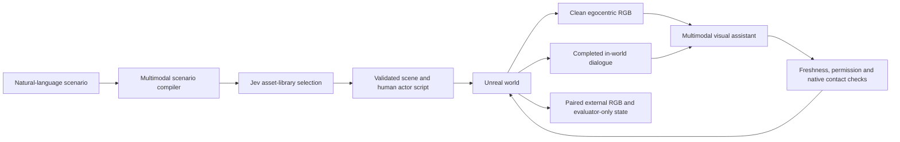

# RGB-driven embodied assistance demo

This prototype demonstrates a bounded natural-language scenario compiler and a
separate embodied assistant in the existing six-room Unreal environment. The
human's route, dialogue and concurrent events are authored stimuli. The
assistant's utterances and action choices come from a live large model, and
native execution receipts establish whether an attempted intervention happened.

## Data flow



`--research` selects this policy explicitly. The default legacy metadata/Jev
policy remains available for earlier demos. Jev chooses an existing furnishing
or micro-room recipe; it does not make the research assistant's final decision.
The teacher deployment explicitly selects `openai/gpt-5.4-mini` on the standard
OpenAI endpoint, with bounded low reasoning. Qwen 35B/397B routes remain supported
explicit alternatives; their development takes are recorded separately. Shared
Qwen provider pools returned HTTP 429 and one route rejected a valid schema, so
the live deployment changed through a recorded manual review, keeping every
reservation and the same allowance. There is no runtime automatic fallback. Runtime keys remain on
the authorized provider host and are accessed through a loopback SSH tunnel.

The native camera produces paired 960 × 540 ego/external PNG frames at 2 Hz,
with a shared engine frame, scene epoch and capture ID. The ego image hides the
wearer's full mesh and retains the headless first-person body. Image compression
and atomic file publication run off the game thread; one bounded capture is
in flight. A short lease stops unused capture. The adapter verifies identity,
freshness and filenames, then archives the exact bytes and hashes.

The model packet is a closed `vista.research-observation/v1` contract: ego RGB,
completed utterances with speaker/audience/source/time, the assistant's own
execution receipt, and six recent decision-memory entries. Future dialogue,
scenario scripts, event IDs, seeds, external-camera pixels, object coordinates
and hidden ground truth are not accepted fields. Trace inspection is an
evaluator privilege, not a model capability. This separation is tested and
auditable within one trusted application; it is not OS-level sandbox isolation.

## Decisions, interruption and execution

The policy chooses a typed action, evidence references, urgency, speech and next
tasks. The model decides relevance and priority. Physical actions require a
recent direct human-to-assistant turn; phone conversation is evidence for memory
but is not permission. A consumed permission cannot be reused. Native motion,
same-floor range, collision, reach/contact and cancellation checks remain
authoritative for execution. A planned action, an accepted command and a
committed shutoff are distinct results in the UI and logs.

The scheduler normally has one policy request in flight. A new human or phone
turn invalidates the old revision and may use a second slot without waiting for
an obsolete slow network response. Two actual requests is the hard bound; when
both slots are occupied, intermediate turns are coalesced into the newest
observation. No same-request paid retry or implicit model/provider fallback is
performed. A new receipt is paired with an image captured after that receipt, preventing
a pre-shutoff flame image from being mistaken for the result of a completed
action. English curly punctuation is canonicalized for the native ASCII caption
path without rewriting words or action fields. Old replies, old errors and
delayed speech cannot overwrite a newer
turn or a stopped/reset world. Responses whose image is over 14 seconds old
cannot act. The teacher deployment uses a 30-second periodic scan (the configurable
default is 12 seconds), while new dialogue and own-action receipts request a
fresh decision immediately. This bounds background cost and does not establish
subsecond hazard detection. Periodic observations occur only during an active scenario; idle
scenes do not continuously spend the model allowance.

The comparison condition `assistant=off` runs the authored human and events
with assistant decisions disabled. Manual observe/chat requests are rejected
while this condition is active; Stop returns control. Audit the actual model
request log and object states, rather than assuming the toggle worked. The
comparison and assisted video are separate executions, not an identical
counterfactual branch from a frozen simulator state.

## Speech and demonstration

Optional `--local-tts` uses CPU Kokoro v1.0 / `kokoro-onnx==0.6.1`, with separate
English male presets for the human, assistant and caller. PCM plays through
Unreal, driving the existing mouth animation and subtitles. Audio is captured
from the game's PulseAudio sink. No narrator or postproduction response track
is added. Completed authored transcripts become observations after playback;
this is not microphone ASR. Open interaction currently uses typed input.

The teacher page at `/research` (also `/` in research mode) exposes prepared
scenario cards, fixed-view replay, the no-intervention comparison, typed chat,
Stop/manual takeover, paired live views, actual execution and an expandable NL
compiler. Verified media can be published as first/third pairs for the main
case, study and control. Videos are native 30 fps captures from separate runs;
the paired live model/review images are synchronized 2 Hz captures. The browser
polls the latest pair approximately once per second; use Moonlight or the movies
for continuous movement.

Prepared cases used for acceptance:

1. In the six rooms, stove and bath tap begin together. The human requests stove
   shutoff, walks upstairs, takes a phone call about a meeting, requests tap
   shutoff and asks the assistant to recall the meeting time and required item.
2. A Chinese NL request selects and assembles a small furnished study, followed
   by two open questions about presenting research to a professor.
3. The first case with assistant decisions disabled, to inspect unresolved
   object states and a zero-request policy trace.

The bath tap runs until the later explicit request. Do not claim this case
prevents overflow, optimizes deadlines or resolves every hazard proactively.
The present permission contract allows one physical action per permission turn.

## Reproduce and audit

Keep assets, model weights, recordings, requests and host service definitions
outside source Git. Use an independently materialized DEV project and preserve
other streaming apps. For an accepted private display, retain `--run`; recording
the selected live demo instead requires an explicit owned project identity:

```sh
uv run --offline --script tools/runtime/vista_live/director_review.py \
  --workspace "$WORKSPACE" \
  --selected-project six-room-companion-dev-director-d \
  --out "$FRESH_EPISODE" --scenario "$SCENARIO_ID" \
  --view first --port 49111 --require-off stove --require-off faucet

PYTHONPATH=tools uv run --offline python -m runtime.vista_live.research_audit \
  --episode "$FRESH_EPISODE" --backend "$BACKEND_ROOT" \
  --require-off stove --require-off faucet
```

The live recorder verifies the selected PID/project/display and audible VISTA
sink before capture. It does not inject input or weaken private input guards.
It runs the same Director API as the browser. Add `--assistant off` and omit
`--require-off` for the comparison. The offline auditor checks actor completion,
fixed view, sampled continuous movement, actual on→committed→off state changes,
closed provider packets and exact archived image hashes. A control requires no
assistant commit and no research call within the recorded episode wall-time
window. Later manual requests in the same scene are listed separately, so they
do not retroactively change the comparison condition. It does not automatically grade dialogue
semantics, visual realism or research-policy success.

## Research scope and limitations

### Delivery validation

The teacher deployment has six native 1920 × 1080, 30 fps H.264/AAC recordings,
totalling 605.23 seconds, with in-world male speech and burned-in native captions.
Each passes complete media decoding, actor completion, fixed-view and continuous
sampled-motion audits. Native audio was also transcribed locally for recording
review; that ASR result never enters the assistant's observations.

| Episode | First-person result | Third-person result |
| --- | --- | --- |
| Concurrent stove, tap and phone | Both controls committed off; correct meeting recall | Both controls committed off; correct meeting recall |
| NL-created study | Human route and two presentation questions completed | Human route and two presentation questions completed |
| Assistant disabled | Zero policy calls; both targets remain on | Zero policy calls; both targets remain on |

The main episodes use low reasoning with a 30-second periodic scan. The study
recordings use the earlier no-reasoning, 12-second setting and include a repeated
response. They are not matched policy comparisons. Main-episode provider latency
p50/p95 was 4.81/5.75 seconds for the first view and 4.67/10.24 seconds for the
third view; these exclude speech generation/playback and physical execution.
One stale response was discarded in the first run. Game tick timings are
recorded separately and are not GPU render-performance benchmarks.

Browser acceptance compiled a new Chinese bedroom description in 5.06 seconds
plus 0.43 seconds for the Jev asset choice, executed the human's walk/speech/wait
script without assistant calls, then answered an unrelated typed sky-colour
question with actual completed native speech. All six movies play in Chromium;
starting either view pauses the other. The offline archive passes CRC checks,
and public byte-range downloads work. Seventy HTTP checks include existing demo
pages, prior theme assets, the six new videos and the archive. Current virtual
input device identities match the owned Sunshine process; other app entries are
unchanged. Mac/Windows client readback was not observed in this iteration.

Local validation: 93 focused tests pass, the 28 contract/compiler baseline tests
pass, and broad discovery reports 520 passes out of 521, with the inherited
failure described below. Final native build 6 succeeds and all 62 native source
files match the deployed payload. Evidence, failed development takes, exact
model inputs, hashes and an offline presentation package remain outside Git in
the workspace's `runs/research-demo-20260921-a/` directory.

The deployed service starts paused and retains a durable, bounded API allowance.
At delivery preparation, 148 of 160 plan requests were used; inspect provider
health for the current remainder. Recorded playback and manual world movement
do not spend that allowance. Do not reset the ledger or silently change its
limits when reproducing the demonstration.

### Remaining research work

This is an initial implementation slice of the broader platform plan, not the
complete benchmark or evidence for a paper's success-rate claim. Novelty would
need controlled, held-out study of timely interruption, delayed observations,
memory, conflicting requests, abstention and physical completion. Appropriate
next comparisons include RGB-only versus RGB+dialogue, full history versus
bounded memory, sequential versus preemptible inference, and assist versus
no-intervention under matched authored conditions. Report tail latency and
failed interventions as well as means and fluent responses.

Room generation currently assembles a bounded asset library. It does not create
arbitrary meshes, textures or a photorealistic human. Manipulation is kinematic
contact, not validated force-based physics. Two prepared cases and development
replays are not a held-out benchmark. Native render, audio, input binding and
browser checks do not establish Mac/Windows client streaming quality.

The local validation receipt records both focused passes and a pre-existing
failure in `test_near_wall_visual_occlusion_is_local_hysteretic_and_provider_safe`,
reproduced on unmodified base `cd0ec2b`. Its assertion is not weakened. This
iteration uses local checks and records zero new GitHub Actions runs; previous
base-head CI success does not validate this changed head.

The model uses an explicitly selected OpenRouter provider endpoint with fallback
disabled, following the [provider routing contract](https://openrouter.ai/docs/guides/routing/provider-selection).
Speech model and wrapper provenance are recorded outside Git with digests:
[Kokoro-82M](https://huggingface.co/hexgrad/Kokoro-82M),
[kokoro-onnx](https://github.com/thewh1teagle/kokoro-onnx).
