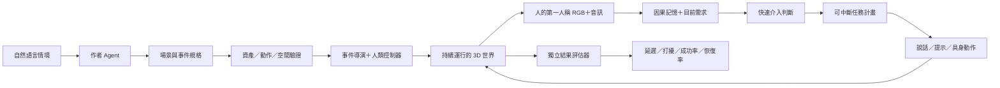

# 從自然語言情境到可測量的連續協助

建議先把研究目標定為：**在持續演化的生活環境中，助手能否用有限資訊，
適時打斷、重新安排優先順序，並在干擾解除後恢復未完成需求？**
場景生成是實驗工具；第一篇的主要結果應是介入造成的世界結果，而非影片是否漂亮。

暫定題目：**VISTA-Live: Interruptible Assistance under Concurrent Everyday Needs**。
這是研究方向與工程設計，不是新穎性或 benchmark 結果的宣稱。

## 這次實作的最小情境

受協助的人準備出門、找不到鑰匙；廚房爐火仍開著。他去拿手機並接工作電話，
浴缸的持續放水事件加入同一世界。助手看見水位接近邊緣後插話，
人暫停通話、放下手機、關水。助手看到關水的反證後恢復爐火待辦；
人回到廚房關火，再去客廳拿鑰匙、帶到玄關。

| 來源 | 本機核對位置 | 本次用途 |
|---|---|---|
| VISTA mmg_001 | multimodal-grounded seeds，safety 1 | 離開前爐火仍開 |
| VISTA mmg_021 | 同一檔案，safety 21 | 浴缸持續放水 |
| VISTA mmg_044 | 同一檔案，non-safety 1 | 鑰匙留在客廳 |

源檔位於 VISTA-Web 的
`benchmarks/vista_mm_dialogue_exp/VISTA_seeds_with_interventions/multimodal_grounded_seeds_with_intervention.md`。
只把它用作**作者設計情境的來源**。電話對話、跨情境的重疊與人物路線是新編排，
並非 VISTA 原本已有的一段長影片；沒有把介入答案送給助手。
浴缸在電話開始後由事件導演注入，並不是已實作另一人去打開水龍頭的動作。

目前人由腳本控制，會依「助手提醒已送出」進入處理分支。助手是獨立的規則決策元件；
可見線索由引擎做視線／遮蔽判斷後輸出，仍是符號 metadata，尚非 RGB/VLM 感知。
人實際透過既有碰撞、拿放與設備操作執行器改變世界，助手本身尚未代人操作設備。
不能以這段工程展示證明 learned planning、通用自主性或完整語音辨識。

## 系統分層

作者與評估器有特權資訊。助手沒有導演時間表、事件 ID、未來事件、成功條件、
精確剩餘 deadline 或全屋物件狀態。第三人稱影片只供審查，不能作為額外感知輸入。
正式評估應把兩邊拆成不同 process／帳號或容器；本次 Python reviewer 與 planner
是介面隔離，**尚無 OS 強制隔離**。

1. **作者 Agent / NL compiler**：先檢索 VISTA 類型，再選六房既有資產與可用動作。
   產出封閉 JSON，列出初始條件、角色目標、事件相依性、可重疊資源、允許的控制組。
   小模型可以做語意解析與候選檢索；幾何和物理約束交給可檢查的工具。
   本次 `scenario.py` 是四類需求的關鍵詞匹配入口，並非通用 NL 模型；
   已列出的否定模式與不支援項目會拒絕；它尚不理解任意語句，
   所以使用前必須審閱編譯後的規格，不能視為通用語意驗證器。
2. **場景建造器**：逐步擴成「選資產→擺放→檢查支撐／門寬／可達性→驗證互動」。
   每件道具必須有尺寸、接觸點、可執行 action 和狀態轉移；漂亮模型不等於可用物件。
   任意新場景生成仍待實作，目前重用經驗證的六個室內空間。
3. **事件導演與 human controller**：各事件維持自己的時鐘，互不重設世界。
   時間觸發、條件觸發與外生事件分開記錄。同一個人的雙手、視線、注意力和所在位置
   是共享資源；不能同時把手機放耳邊又用同一隻手去轉開關。
   未來加入合理的反應延遲、拒絕、誤聽與不同生活習慣，避免人永遠完美服從。
4. **感知與記憶**：每個證據帶 acquisition time、available time、來源與置信度。
   保存觀察到什麼、何時最後確認、尚未完成的需求和已送出提醒。
   「看不見」不等於「已解決」；他人口頭聲稱與新的視覺反證要能並存。
5. **快速介入與慢速計畫**：先短句 alarming，再更新較長 planning。
   Jev 可放在「是否打斷／哪個已觀察需求優先」的窄決策介面；
   generative model 負責把現有證據變成短計畫、對話與動作選擇。
   記憶、去重、工具授權、資源占用及 stale plan 取消由程式管理。
   本次未把 Jev 接進 native loop，不能把規則成功率標成 Jev 成績。
6. **具身執行與結果確認**：動作包含前置條件、接近、對準、接觸、commit、
   release、settle、成功回報與可安全取消點。說過「關水」不算關水成功；
   要等新的可觀察證據，評估器另用真實設備狀態計分。

優先順序應根據估計的危害、時間餘裕、距離、操作耗時、失敗機率與打擾成本決定。
本次規則只在「浴缸已接近滿、爐火未呈現煙火等更高危害」的限定情況優先處理水，
不是對所有情境宣稱水比火重要。正式方法不能讀取真實 deadline 排序。

## 應該驗證的研究假設

| 問題 | 控制變因與比較 | 主要量測 |
|---|---|---|
| 併發是否使助手忘掉需求？ | 1/2/3/4 個需求；相同底層活動；不同重疊量 | 成功率、漏提醒、恢復率 |
| 快速提醒能否減少失敗？ | 單一慢 planner、快速 gate＋planner、rules | 從可用證據到**正確可執行介入**的 p50/p95、deadline miss |
| 何時保持安靜更有用？ | 普通通話、低風險、已自行解除、拒絕介入 | 每分鐘誤打擾、重複提醒、對話中斷長度 |
| 記憶如何處理過時資訊？ | 出視野、他人代做、口頭與視覺矛盾 | stale warning、反證更新、未完成需求保留 |
| 建場景工具能否支援泛化？ | 未見的房間布局／組合／物件替代 | 可執行規格率、物理驗證率、跨場景表現 |

需要無助手、定時提醒、rules、小模型、Jev gate＋planner、單一較大模型等基線；
並做移除記憶、移除 preemption、移除對話干擾、移除結果確認的 ablation。
一開始以 3–5 分鐘工程片段排除動作失敗，再做 15–30 分鐘、多個 seed 的長 episode。
這些時長與配置是後續實驗計畫，不是本次已完成數量。

把同一個初始狀態、事件隨機種子、人的目標與反應規則固定，分別跑「有／無介入」；
介入後允許世界軌跡分歧。用成對差值與信賴區間量測實際改善，
不能只對同一段固定影片換一套文案就稱為 counterfactual outcome。
人工可觀察介入窗口與真實危害 deadline 分開標；模型只看得到前者的原始感知。
未觀察到的角色狀態、導演時間表與未來內容不進模型 prompt；
觀察時間戳與可辨識的說話者則保留。測試集的組合／場景保持隔離。

## 與近期研究的關係

[ProAssist (EMNLP 2025)](https://aclanthology.org/2025.emnlp-main.605/)
已研究 streaming ego video 的主動對話。
[Pro²Assist (2026)](https://arxiv.org/abs/2605.04227)
已追蹤長流程任務的步驟並提供持續協助。
[Vinci2 / EgoServe (ECCV 2026)](https://arxiv.org/abs/2607.11523)
已研究連續 ego 情境中的介入時機與多尺度記憶。
[PARTNR](https://arxiv.org/abs/2411.00081) 已研究家居多 Agent 的規劃與協作。

因此「長影片＋主動提醒」或「NL 建 3D 場景」本身不足以支持新論文貢獻。
建議深入檢驗的是**併發需求下，受觀察限制、可搶佔與恢復的協助，
是否在閉環世界中改善生活結果，同時減少打擾**。
這是根據以上工作的定位推論，仍需完整 related-work 與實驗確認。

## 影片與可重現性

第一人稱、第三人稱是兩次獨立 native 執行；各版不切鏡頭、不在中途瞬移。
它們使用相同情境和路線，實際時間與物理接觸可不同，不宣稱同一條同步軌跡。
第三人稱審查時，symbolic observation 和操作視線仍固定在人的眼睛位置。
只播放使用者、助手與電話另一端的英文合成男聲，沒有解說旁白。
對話文字預先撰寫、語音先合成並快取；規則決策選擇何時播放助手台詞。
本次不能用來估計即時模型生成、ASR 或 TTS 的端到端延遲。
原始音訊在引擎中播放，人物嘴部以音量 envelope 近似，不是完整音素 lip sync。

每次執行保留 observation、decision、實際 native action receipt、對話開始時間、
事件結果、固定視角檢查及完整錄影。測試失敗的試跑保留，不能剪去失敗後假稱連續成功。
生成影片、二進位資產、密鑰、canonical VISTA 資料均不進 source Git；
現有商用／外部資產的 demo 使用範圍不代表可公開散布為 benchmark。
